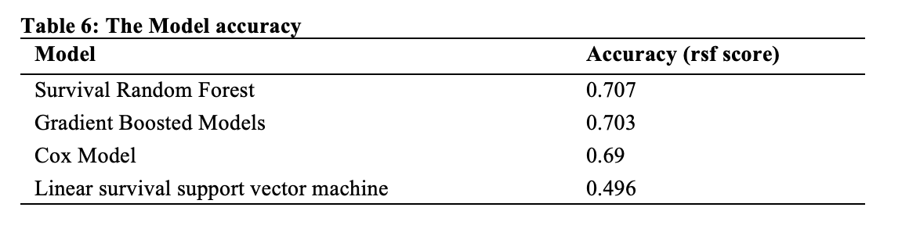

# Time to onset of Heart disease using Allostatic load

## Executive Summary
Cardiovascular disease (CVD) is one of the leading causes of death in the US costing the United States healthcare system about $531 billion in direct and indirect costs. Research has shown that providers do not accurately estimate the risk of CVD events on their own. Therefore, multivariate risk prediction equations have been derived from large cohort studies or randomized trials to estimate CVD risk in time intervals studies. The most used CVD risk prediction models in the United States are based on the Framingham Heart Study cohort. Although the models have been validated with multiple diverse population studies, there is a controversy on the variables that are the most important for risk prediction that can be generalized downstream across the populations. In this project, we used Framingham Offspring Cohort to examine the impact of the allostatic load on the onset of heart disease in men and women. Allostatic load has been shown to be a marker of overall physiological health and is linked to cardiovascular events. There is paucity of information on studies done to estimate the impact of allostatic load on the time to onset of heart disease using a prospective cohort. This project uses data from the 1972 to 2018 Framingham heart study (Offspring Cohort) from the National Heart Lung and Blood Institute (NHLBI). Multiple imputation was used to compute data if it was missing 25% or less. Random Survival Forest model was used to estimate the hazard of heart disease onset by sex. Over the 46 person-years follow up time, there was an overall 1212 heart disease events (men: 59% vs women 41.9%, p<0.001). Males were at 76% higher risk of earlier onset of heart disease than the female counterparts (HR=1.76, 95% CI=1.56-1.99). Participants with higher allostatic load were more than twice as likely to develop early onset of heart disease (HR=2.12, 95% CI=1.84-2.45). Model accuracy for Survival random forest for predicting heart disease using allostatic load was 0.707. Based on the 10 variables used to determine allostatic load, C-reactive protein variable had the greatest contribution to heart disease followed by the ratio between high-density lipoprotein cholesterol to total cholesterol ratio. This secondary analysis found the higher allostatic load is associated with shorter time to onset of heart disease with men experiencing shorter time to onset of heart disease than women.

## The project objectives
1.	Describe the distribution of allostatic load factors in the Offspring Cohort of the Framingham Heart Study (hereafter referred to as FHS) by sex.
2.	Examine whether allostatic load variables predict time to onset of heart disease (coronary heart disease and heart failure) differently in men and women.
3.	Test the performance of five models (Cox proportional-hazard model, Survival Random Forest, Gradient Boosted Models, Linear survival support vector machine, and Kaplan-Meier) in prediction of time to onset of heart disease using allostatic load.
4.	Describe variable importance (allostatic load variables) used for predicting time to onset of heart failure.

## Data
The FHS dataset was obtained from National Heart Lung and Blood Institute (NHLBI) Biologic Specimen and Data Repository Information Coordinating Center. In 1948, a sample of 5209 Original Cohort participants aged 28 to 62 years was recruited. The offspring cohort was enrolled in 1971 with a total of 5124 participants aged 5 to 70 years and comprised of children of the original cohort. The FHS is among the longest running multi‐generational epidemiological studies focusing on the epidemiology of CVD.3 It is comprised of community dwelling individuals selected using systematic random sampling of residents of Framingham, MA, consisting of several intergenerational cohorts. All data is de-identified and participants provided informed written consent13,14. The present analysis focused on the Offspring Cohort. The offspring cohort data consisted of many variables that was collected during the studies, but only 10 variables of interest were considered for this capstone project. The variables descriptions are shown below:

•	pid: participant unique id
•	sex: male = 1 Female = 2
•	age1: age in years
•	bmi: body mass index
•	years of education: the number of years a participant attended school
•	sbp: systolic blood pressure
•	dpb: diastolic blood pressure
•	alb: albumin
•	s_creatinine: serum creatinine
•	creat: Creatinine
•	crp: C-reactive protein
•	tchol: total cholesterol
•	hba1c: glycated hemoglobin
•	hdlchol: high-density lipoprotein cholesterol
•	hdlchol_ratio: ratio between high-density lipoprotein cholesterol and total cholesterol
•	maritalst: marital status 1 = married, 2 = single/divorced, 3 = widowed
•	cvd: censoring status 1 = participant experience a cardiovascular event, 0 = censored
•	alload: calculated load score from the 10 biomarkers
•	timetoeventcvddate: time to event of cardiovascular disease (cvd) onset since birth in years

## Methodology
The most preferred method for determining scores for allostatic load uses empirically derived clinically relevant cut points 15. The cut off points are determined by pre-established values in clinical medicine and generate three categories: high-risk (1 point), moderate-risk (0.5 point), and low-risk (0 points)16. Table 1 shows how the scores were defined and coded. Each allostatic load has a maximum of 1 score, and the total maximum allostatic load score for the 10 variables is equal to 10.
The studies have shown that heart diseases cannot be prevented or treated successfully without addressing the responsibility of stress in conjunction with environmental and genetic factors 17. The allostatic load score (ALS) has been a common method used to measure the physiological reaction to stress. This was determined using the scale set by Duong et al.17 as shown in Table below, with 1, 0.5 and 0 values being categorized as high, medium, and low risk respectively.

## Data imputation
We determined that the missing data was missing completely at random (MCAR). We conducted multiple imputation for variables with less than 25% missing values. It is recommended to conduct multiple imputation if under 25% of the participants have missing covariates to preserve power18,19.

Table below provides the variables used during the project and the percentage of missing values. Creatine and body mass index were the two variables with the highest missing values. As stated above, all the variables of interest were imputed using multiple imputation method. Systolic and Diastolic blood pressure had the least percentage of values missing because it has always been one of the basic components for vital checkup.

The figure above shows the imputed data overlay, where the original values are in blue color, and imputed values are in red color.

## Analysis/Results

The prediction of the time to onset of a cardiovascular disease using different models provided high accuracy on validation data as shown in the Table 6. Survival Random Forest gave the highest level of accuracy compared to all the models used. The model accuracy for survival random forest and gradient boosted models were similar (0.707 and 0.703).

  

## Kaplan-Meier Model
The figure below is the Kaplan-Meier survival curves showing clear distinction between time to onset of cardiovascular disease for men and women. The allostatic load was categorized into high (greater than five) and low (less than five). From the model, female participants in the study that had allostatic load of less than five had a longer time to cardiovascular event (median= 88 years) compared to males with same allostatic load category. Male participants with higher allostatic load had the shortest time to cardiovascular event (median = 68 years).

## Cox Proportional Hazard Ratio

The above chart (Table 8) shows the Cox proportional hazard ratio forest plot for the different covariates (gender, education, marital status, age group and allostatic load) in our dataset. The Hazard Ratio (HR) that is greater than 1 indicates an increased risk of a cardiovascular event. The HR for gender is 1.76 which shows that males have a higher risk of a heart diseases event than their female counterparts (males are at 76% higher risk of earlier onset of heart disease than the female counterparts) (HR=1.76, 95% CI=1.56-1.99). Individuals with higher allostatic load were more than twice as likely to develop early onset of heart disease (HR=2.12, 95% CI=1.84-2.45). The 95% confidence interval was 1.84 – 2.45 and thus is statistically significant. Therefore, gender, age group and allostatic load significantly influence individuals’ risk of time to onset of cardiovascular disease.

## Improving the accuracy
The use of gradient boosting on Cox’s partial likelihood restricts regression trees base learners to only using a single split (the stumps). This model achieves a concordance index of 0.703 on the test data. The test performance changes with the ensemble size (n_estimators) (Figure 1). The performance improves quickly, but then it starts to decrease if the ensemble becomes too big. On the other hand, using component-wise least squares base learners (Figure 2), the performance increase is slower, but its maximum performance is above that of the ensemble of tree-based learners. This is because with component-wise least squares base learners, the overall ensemble is a linear model, while with tree-based learners it is be a non-linear model. Figures 1 and 2 shows the difference between the ensemble tree-based learners and the component-wise least squares base learners.

       
